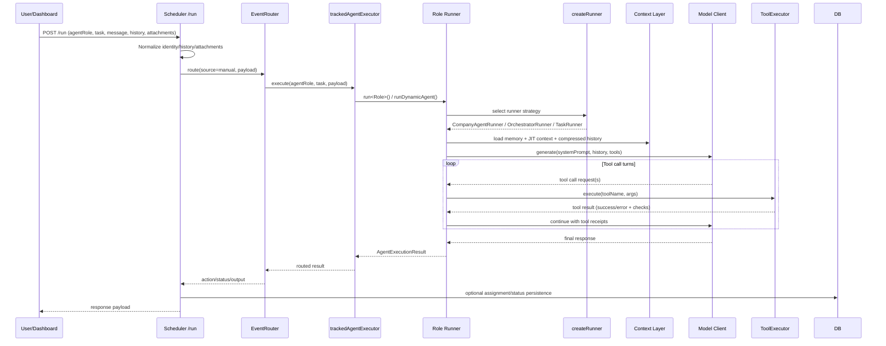
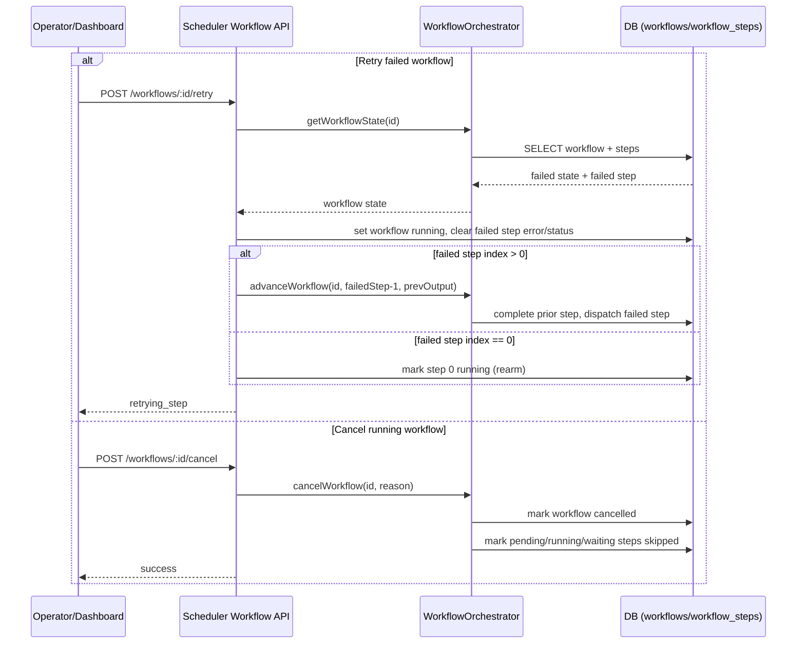
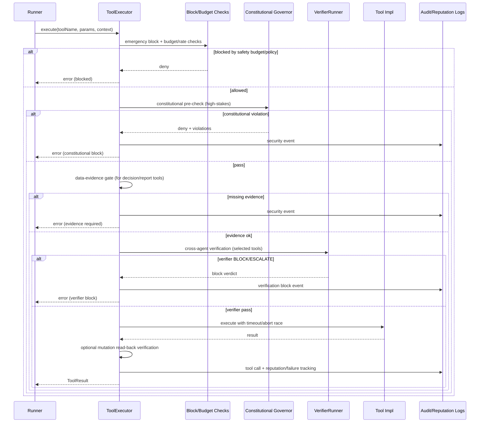
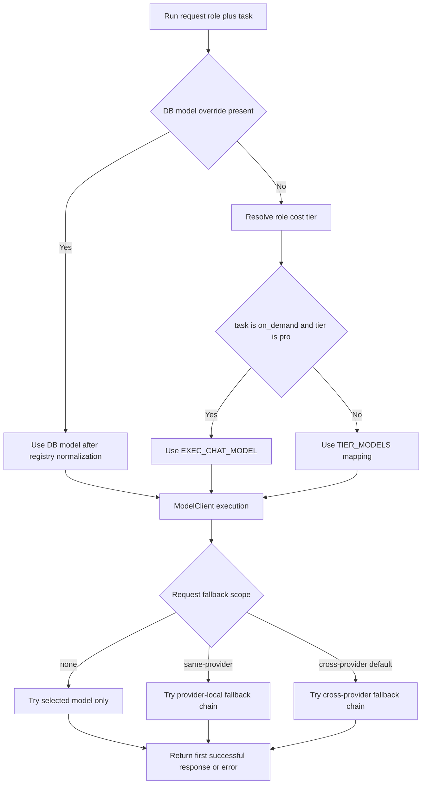

# Glyphor AI Company - Full Technical Architecture

Last updated: 2026-04-05

This document is the full technical architecture readout for the current monorepo.
It combines a full subsystem walkthrough with current, filesystem-verified inventory counts.

## 1. Executive Summary

Glyphor is a multi-service, multi-agent operating platform built as a TypeScript-first monorepo with additional Python components for graph indexing. The platform runs role-based and dynamic agents, orchestrates work through a scheduler control plane, persists memory and operations in PostgreSQL, and exposes operator workflows through a React dashboard.

At a high level:

- Control plane: scheduler, authority gating, work routing, decision workflow, policy and analysis engines.
- Execution plane: agent-runtime + role runners + tool execution + provider abstraction.
- Data plane: Cloud SQL-backed memory, operations, routing, and telemetry state.
- Operator plane: dashboard, settings, approvals, directives, governance, and strategy surfaces.
- Integration plane: Stripe, Mercury, GCP, Teams/Graph, OpenAI, Anthropic, Kling, SharePoint, GitHub, Vercel, Canva, DocuSign, Cloudflare, and others.

## 2. Current State Inventory

Verified from repository state:

- Workspace packages under packages: 25
- Integration modules under packages/integrations/src: 21
- File-based agent role directories under packages/agents/src: 28
- Dashboard page modules under packages/dashboard/src/pages: 36
- SQL migrations under db/migrations: 284
- Docker build files under docker (Dockerfile.*): 18
- Smoketest layers under packages/smoketest/src/layers: 31 (layer 0-30)
- Dashboard route architecture: dual-mode (app/internal + app/smb) with 27 internal path routes, 7 SMB path routes, legacy redirects, and entry gates
- Dashboard TABLE_MAP aliases in packages/scheduler/src/dashboardApi.ts: 88 aliases mapped to 60 physical tables

Top-level packages currently present:

- a2a-gateway
- agent-runtime
- agent-sdk
- agents
- company-knowledge
- company-memory
- dashboard
- graphrag-indexer
- integrations
- mcp-data-server
- mcp-design-server
- mcp-email-marketing-server
- mcp-engineering-server
- mcp-finance-server
- mcp-hr-server
- mcp-legal-server
- mcp-marketing-server
- mcp-slack-server
- scheduler
- shared
- slack-app
- smoketest
- voice-gateway
- worker

## 3. Architectural Principles

- Database-first runtime truth: agent state, assignments, routing, and telemetry are persisted and queryable.
- Role-aware execution: runners are selected by role and task semantics.
- Separation of control and execution planes: scheduler orchestrates, runtime executes.
- Tool governance and safety: tools are routed and constrained through runtime definitions and policy workflows.
- Multi-provider model abstraction: provider adapters normalize behavior across model vendors.
- Operator transparency: dashboard surfaces route status, directives, approvals, profiles, and governance controls.

## 4. High-Level Topology

```text
Triggers and Inputs
  - Cloud Scheduler
  - Dashboard actions
  - Teams events and Graph callbacks
  - Webhooks (billing and platform)
  - Internal events and wake signals

        |
        v
Scheduler Service (control plane)
  - routing, orchestration, authority checks
  - analysis/simulation/strategy workflows
  - dashboard CRUD/API mediation

        |
        v
Agent Runtime (execution plane)
  - runner selection
  - provider model calls
  - tool execution and result handling
  - context/memory loading and reflection

        |
        v
Company Memory (data plane)
  - PostgreSQL operational state
  - vector-backed and graph-backed memory tables
  - persistent history and governance logs

        +---------------------------+
        |                           |
        v                           v
Dashboard UI                  External Integrations
React/Vite operator surface   Stripe, GCP, Teams, etc.
```

## 5. Core Services and Responsibilities

### 5.1 Scheduler (packages/scheduler)

Primary role:

- Cloud Run entrypoint for orchestration, route handling, policy/evaluation flows, and scheduled triggers.

Major responsibilities:

- Route trigger handling for scheduled and direct runs.
- Event routing and wake handling.
- Decision and approval lifecycle integration.
- Dynamic scheduling and heartbeat checks.
- Analysis engines (analysis, simulation, deep dive, strategy lab, CoT).
- Dashboard API facade and governance API surfaces.

Representative modules:

- server.ts
- eventRouter.ts
- authorityGates.ts
- decisionQueue.ts
- dynamicScheduler.ts
- heartbeat.ts
- wakeRouter.ts
- analysisEngine.ts
- simulationEngine.ts
- deepDiveEngine.ts
- strategyLabEngine.ts
- cotEngine.ts
- dashboardApi.ts
- governanceApi.ts
- memoryConsolidator.ts
- memoryConsolidationGates.ts
- memoryArchiver.ts
- abacAdminApi.ts
- autonomyAdminApi.ts
- capacityAdminApi.ts
- contradictionAdminApi.ts
- contradictionProcessor.ts
- decisionTraceAdminApi.ts
- departmentAdminApi.ts
- disclosureAdminApi.ts
- handoffContractAdminApi.ts
- handoffContractMonitor.ts
- handoffQualityEvaluator.ts
- handoffTracer.ts
- metricsAdminApi.ts
- temporalKnowledgeGraphAdminApi.ts
- predictionResolver.ts
- planningGateMonitor.ts
- economicsGuardrailNotify.ts
- toolAccuracyEvaluator.ts
- batchOutcomeEvaluator.ts

### 5.2 Agent Runtime (packages/agent-runtime)

Primary role:

- Unified runtime framework for all agent executions independent of role specialization.

Major responsibilities:

- Execution state machine and runner abstractions.
- Multi-provider model access.
- Tool registry and tool execution bridge.
- Context loading and memory injection.
- Event bus integration and telemetry emissions.
- Reasoning and verification helpers.

Key architectural primitives:

- AgentConfig and CompanyAgentRole typing in types.ts.
- ConversationTurn and attachment transport model.
- AgentExecutionResult with cost and provider metadata.
- Supervisor constraints (turn limits, stalling, timeout semantics).
- ABAC (attribute-based access control) enforcement via abac.ts.
- Disclosure management for agent identity transparency via disclosure.ts.
- Temporal knowledge graph client via temporalKnowledgeGraph.ts.
- Prediction journal for agent forecast tracking via predictionJournal.ts.
- Handoff contracts for structured inter-agent delegation via handoffContracts.ts.
- Shadow runner for parallel evaluation via shadowRunner.ts and shadowPromotion.ts.
- Memory consolidation and episodic replay via memoryConsolidator integration.
- Verification policy enforcement via verificationPolicy.ts.

### 5.3 Agent Implementations (packages/agents)

Primary role:

- Role-specific prompts, toolsets, and runners for file-based agents plus shared execution wiring.

File-based role directories currently present (28):

- chief-of-staff
- cto
- cpo
- cmo
- cfo
- clo
- vp-sales
- vp-design
- vp-research
- platform-engineer
- platform-intel
- quality-engineer
- devops-engineer
- m365-admin
- global-admin
- user-researcher
- competitive-intel
- content-creator
- seo-analyst
- social-media-manager
- ui-ux-designer
- frontend-engineer
- design-critic
- template-architect
- head-of-hr
- ops
- competitive-research-analyst
- market-research-analyst

Runner selection is centralized in shared/createRunner.ts:

- on_demand task -> CompanyAgentRunner
- orchestrator roles -> OrchestratorRunner
- all other role/task combinations -> TaskRunner

### 5.4 Company Memory (packages/company-memory)

Primary role:

- Persistence contracts and data access layer for company state, memory, and graph knowledge.

Major responsibilities:

- Cloud SQL persistence for operational and memory entities.
- Embedding and retrieval support for semantic memory.
- Shared memory and world model update pathways.
- Graph read/write interfaces.

### 5.5 Integrations (packages/integrations)

Primary role:

- External system connectivity and domain-specific API clients.

Current integration modules (21):

- agent365
- anthropic
- canva
- cloudflare
- credentials
- docusign
- facebook
- gcp
- github
- governance
- kling
- linkedin
- mercury
- openai
- posthog
- search-console
- sendgrid
- sharepoint
- stripe
- teams
- vercel

Integration entrypoint exports include capabilities for:

- Teams messaging and cards
- Graph chat and subscription management
- Email and calendar operations
- Payment and billing ingestion
- Cloud metrics and deployment telemetry
- Document and creative workflows
- Cloudflare preview site management

### 5.6 Dashboard (packages/dashboard)

Primary role:

- Operational control and observability UI for founders and operators.

Stack:

- React 19
- Vite
- TypeScript
- Tailwind CSS
- React Router

Authentication modes (lib/auth.tsx):

- Teams SSO flow when in Teams context.
- Google OAuth flow in browser context.
- Dev fallback mode when client ID is absent.

Dashboard mode routing:

- Dual-mode layout: `app/internal` (full operator surface) and `app/smb` (simplified SMB surface).
- Entry gate (`DashboardEntryGate`) routes to internal or SMB dashboard based on effective mode.
- Onboarding gate (`OnboardingEntryGate`) routes to mode-specific onboarding.
- Legacy path redirects rewrite bare paths (e.g. `/workforce`) to `/app/internal/workforce`.

### 5.7 Worker (packages/worker)

Primary role:

- Cloud Tasks processing surface for asynchronous execution and output delivery.

### 5.8 Voice Gateway (packages/voice-gateway)

Primary role:

- Voice session lifecycle and realtime voice bridge workflows.

### 5.9 GraphRAG Indexer (packages/graphrag-indexer)

Primary role:

- Graph-oriented extraction, indexing, and bridge operations.

### 5.10 Slack Surfaces (packages/slack-app and packages/mcp-slack-server)

Primary role:

- Slack ingress workflows and Slack MCP operations.

### 5.11 A2A Gateway (packages/a2a-gateway)

Primary role:

- Agent-to-agent protocol bridge and task forwarding edge surface.

## 6. End-to-End Runtime Flows

### 6.1 Scheduled Work Flow

```text
Cloud Scheduler trigger
  -> scheduler route ingestion
  -> role/task resolution
  -> tracked execution call
  -> runtime runner selection
  -> model/tool turns
  -> result persistence
  -> post-run events and telemetry updates
```

### 6.2 On-Demand Chat Flow

```text
Dashboard chat request
  -> scheduler /run mediation
  -> on_demand task path
  -> CompanyAgentRunner
  -> conversation history + context loading
  -> provider response + tool calls
  -> persisted conversation and activity
```

### 6.3 Directive and Assignment Flow

```text
Directive created or updated
  -> scheduler/directive handling
  -> assignment dispatch and routing
  -> role agents execute work
  -> assignment output persisted
  -> approvals/escalations if required
```

### 6.4 Inter-Agent Communication Flow

```text
Agent event or message
  -> event bus route
  -> wake routing / queue checks
  -> target agent run
  -> response persisted and optionally surfaced to dashboard or Teams
```

### 6.5 Reflective Learning Flow

```text
Run completes
  -> reflection generation
  -> memory writes
  -> skill and feedback updates
  -> optional graph/world-model updates
```

### 6.6 Runtime Logic Pipeline (Detailed)

This is the concrete decision-and-execution pipeline used when an agent run is triggered.

1. Ingress normalization and request shaping
   - Primary entrypoint: scheduler `server.ts` (`POST /run`, `POST /event`, `POST /pubsub`, Graph webhook path).
   - User identity, chat history, and attachments are normalized into runtime payloads before routing.
   - For direct chat requests, identity context is prepended and dashboard history is converted to runtime `ConversationTurn` entries.

2. Control-plane routing and wake semantics
   - `EventRouter` handles event-originated dispatch.
   - `WakeRouter` handles reactive wake-ups (messages, webhooks, urgency signals).
   - `HeartbeatManager` and `DynamicScheduler` drive periodic and schedule-based runs.
   - `DecisionQueue` provides queue-backed escalation and decision routing hooks.

3. Runner strategy selection
   - `packages/agents/src/shared/createRunner.ts` enforces runner selection policy:
     - `on_demand` -> `CompanyAgentRunner`
     - orchestrator roles -> `OrchestratorRunner`
     - all others -> `TaskRunner`
   - Model choice is resolved through shared optimization (`resolveModel` -> `optimizeModel`) with explicit DB overrides honored.

4. Context assembly and compression
   - `BaseAgentRunner` / `CompanyAgentRunner` assemble run context from:
     - chat history and current input
     - attachments (including document text extraction for office files)
     - shared memory + profile context
     - JIT retrieval via `JitContextRetriever`
   - `historyManager` performs compaction/compression and tool-pair sanitation before model calls.

5. Subtask routing and value gating
   - `routeSubtask` computes per-turn routing and capability posture (model route + complexity classification).
   - Optional deterministic pre-check path can skip expensive model calls when criteria are met.
   - Optional value gate (`reasoningEngine.evaluateValue`) can abort low-value runs before full execution.

6. Tool-aware generation loop
   - Supervisor enforces hard run constraints (turn limits, timeout/abort semantics).
   - Prompt + filtered tool declarations are sent to provider adapters through the model client.
   - Tool availability can be narrowed by role/task subsets before each call.

7. Tool policy enforcement and execution controls
   - `ToolExecutor` enforces multiple guard layers for mutative and high-stakes actions:
     - block/grant enforcement and reputation telemetry
     - formal budget verification (`FormalVerifier`)
     - constitutional pre-check (`constitutionalPreCheck` via `ConstitutionalGovernor`)
     - data-evidence gate for decision/report tools
     - optional cross-agent verifier gate (`verifierRunner`)
   - Runtime/dynamic tools are supported via `RuntimeToolFactory` and `dynamicToolExecutor`.
   - MCP name-shape normalization is handled in executor alias resolution (namespaced-to-concrete tool mapping).

8. Post-response constitutional and trust feedback
   - Final text can be constitutionally evaluated post-generation.
   - `TrustScorer` applies deltas from constitutional outcomes, verifier confidence, and run quality signals.
   - `DecisionChainTracker` records chain-level reasoning metadata for downstream auditability.

9. Persistence and side effects
   - Outputs, action receipts, and status transitions are persisted to operational tables.
   - Assignment-linked runs update `work_assignments` output/status directly.
   - Follow-on workflow, wake, or notification paths are triggered based on run result and priority.

### 6.7 Intelligence Layers (Operational Stack)

The platform intelligence model is layered rather than a single monolithic "agent brain." Each layer has explicit ownership and artifacts.

| Layer | Purpose | Primary components | Output artifact |
| --- | --- | --- | --- |
| L0 Signal Intake | Normalize external and internal triggers | `server.ts`, Graph webhook handler, `/run`, `/event`, `/pubsub` | Canonical run/event payload |
| L1 Control Routing | Decide who should run and when | `EventRouter`, `WakeRouter`, `HeartbeatManager`, `DynamicScheduler` | Routed execution intent |
| L2 Runner Selection | Choose execution archetype | `createRunner.ts`, `CompanyAgentRunner`, `OrchestratorRunner`, `TaskRunner` | Runner + model envelope |
| L3 Context Intelligence | Build relevant working context | `JitContextRetriever`, memory/profile loading, `historyManager` | Compressed, relevance-scoped context |
| L4 Planning/Reasoning | Determine approach and decomposition | `routeSubtask`, value gate, reasoning hooks, role prompts | Turn strategy + tool plan |
| L5 Action Intelligence | Execute tools safely and adaptively | `ToolExecutor`, tool subsets, runtime/dynamic tool execution | Tool results + action receipts |
| L6 Assurance Intelligence | Prevent unsafe/invalid outputs | `FormalVerifier`, constitutional pre-check/eval, verifier runner | Allow/block decisions + violations |
| L7 Trust and Adaptation | Continuously score execution reliability | `TrustScorer`, tool reputation tracker, drift detector | Trust deltas and reliability state |
| L8 Learning and Memory | Convert outcomes into durable improvement | reflection flow, `skillLearning`, task outcome harvesting, memory lifecycle jobs | Episodic/procedural memory + skill updates |
| L9 Governance and Oversight | Human-in-loop and policy lifecycle control | authority gates, `DecisionQueue`, governance/policy endpoints, canary evaluators | approvals, policy versions, audit trails |

### 6.8 Intelligence Modes in Production

Glyphor currently runs multiple intelligence modes in parallel, each with different latency and assurance profiles.

- Conversational execution mode
  - Used by on-demand chat and agent interactions.
  - Optimized for iterative turn-taking with tool calls and fast memory retrieval.

- Orchestration mode
  - Used by orchestrator roles and workflow tasks.
  - Emphasizes decomposition, delegation, and cross-agent coordination.

- Analytical synthesis mode
  - Implemented by analysis engines (`analysis`, `simulation`, `cot`, `deep-dive`, `strategy-lab`).
  - Produces durable analytical artifacts and optional visual/report exports.

- Triangulated reasoning mode
  - Used by Ora chat surfaces (`/ora/chat`, `/chat/triangulate`).
  - Blends model/provider perspectives with retrieval context for selection and synthesis.

- Governance and assurance mode
  - Runs continuously around execution via constitutional checks, verifier paths, trust scoring, and policy/canary evaluators.
  - Converts raw agent output into policy-compliant operational behavior.

### 6.9 Failure Semantics and Recovery Contracts

This section defines how failures are handled at each layer, what fails closed vs fails open, and where recovery occurs.

| Layer | Failure types | Default behavior | Recovery path |
| --- | --- | --- | --- |
| L0 Signal Intake | malformed payload, auth/token failure, unknown route, integration not configured | return HTTP error (`400`, `401`, `404`, `503`) | caller retry or configuration correction |
| L1 Control Routing | event dispatch errors, wake processing errors | best-effort processing; route returns structured failure when dispatch fails | event replay, manual re-run, or wake retry via scheduler endpoints |
| L2 Supervision | max turns exceeded, timeout exceeded, stalled turns | supervisor aborts run with explicit reason (`max_turns_exceeded`, `timeout`, `stalled`) | re-run with adjusted config/context or reduced tool plan |
| L3 Context Intelligence | JIT retrieval/cache/read failures | fail-open; run continues with reduced context | next turn/run may repopulate retrieval cache and memory context |
| L4 Planning/Reasoning | value-gate abort, model request error | value gate may abort pre-loop; model errors terminate current run path | retry run, switch model routing tier, or reduce task scope |
| L5 Tool Execution | tool timeout, tool exception, abort signal, repeated tool failure | returns structured tool failure; run can continue or terminate based on caller behavior | per-call timeout handling, alternate tools, and repeated-failure escalation |
| L6 Assurance Intelligence | budget violation, constitutional violation, evidence-gate violation, verifier block | fail-closed for policy/budget/evidence/verifier denials; pre-check infra errors are fail-open | revise plan/tool args, gather required evidence, or escalate for human review |
| L7 Workflow Orchestration | step failure, wait timeout, queue unavailable | retries with backoff; on policy exhaustion marks step/workflow failed; queue absence logs manual dispatch | retry endpoint, cancel endpoint, approval/webhook resolution, operator intervention |
| L8 Learning/Trust | trust write errors, drift scoring issues, reflection write errors | non-fatal where possible (warnings/logging) to preserve availability | periodic maintenance jobs and future runs restore learning signals |
| L9 Governance | policy eval/canary workflow errors | recorded as failing/stale governance operations, not silent success | rerun policy jobs, canary checks, or manual governance resolution |

Current concrete reliability controls implemented in runtime/control plane:

- Supervisor guardrails
  - `AgentSupervisor` enforces max turns, max stall turns, and per-run timeout.
  - Abort is propagated through `AbortController` into tool/model operations.

- Tool execution timeboxing
  - Standard tool timeout: `30s`.
  - Long-running tool timeout: `120s`.
  - Execution races against timeout and abort signal.

- Assurance gates (high-stakes path)
  - Formal budget checks can block mutative actions.
  - Constitutional pre-check can block disallowed high-stakes actions.
  - Data-evidence gate blocks decision/report generation without substantive prior data retrieval.
  - Cross-agent verifier can block or escalate sensitive actions.

- Workflow recovery contracts
  - Step retries use exponential backoff (`30s`, `60s`, `120s`).
  - `wait_*` steps fail after max wait window (`48h`).
  - Cancel path marks workflow cancelled and skips pending/running/waiting steps.
  - Retry endpoint can restart from failed step or rearm step 0.

- Repeated-failure escalation
  - Repeated tool failures are tracked in a rolling 1-hour window.
  - On threshold breach, a system activity-log escalation event is written for CTO/ops visibility.

### 6.10 Sequence Diagrams (Critical Paths)

#### 6.10.1 On-Demand `/run` Execution Path



#### 6.10.2 Workflow Retry/Cancel Path



#### 6.10.3 High-Stakes Tool Verification Path



### 6.11 Production SLI/SLO and Ownership Contracts

This section converts architecture layers into measurable reliability contracts.

Scope notes:

- Targets are monthly unless otherwise specified.
- Policy-denied actions are tracked separately from execution errors.
- Planned maintenance windows are excluded from availability SLOs.

| Contract | SLI definition | Target SLO | Error budget | Primary telemetry source | Primary owner |
| --- | --- | --- | --- | --- | --- |
| Control-plane availability | non-5xx response ratio for scheduler ingress (`/run`, `/event`, `/pubsub`, webhook entrypoints) | >= 99.90% | <= 43m 49s/month | Cloud Run request logs + scheduler health checks | Scheduler platform owner |
| On-demand responsiveness | p95 end-to-end latency for successful `/run` chat invocations | <= 12s p95 | <= 5% of monthly successful runs above 12s | `agent_runs` + API timing logs | Agent runtime owner |
| Tool execution reliability | successful tool call ratio excluding constitutional/policy-denied actions | >= 97.00% | <= 3.00% monthly failed tool executions | tool result telemetry + `tool_reputation` | Runtime tooling owner |
| Workflow completion reliability | workflow runs finishing `completed` before max wait horizon | >= 98.00% | <= 2.00% monthly failed/timed-out workflows | `workflows`, `workflow_steps`, orchestrator logs | Workflow orchestration owner |
| Assurance gate correctness | mutative/high-stakes actions with enforced pre-check trail (`constitutional`, `budget`, `evidence`, `verifier`) | 100.00% | 0 missing assurance trails | `constitutional_gate_events`, audit/security logs | Governance and assurance owner |
| Persistence durability | successful write transaction ratio for critical runtime entities (`agent_runs`, `work_assignments`, `decisions`) | >= 99.99% | <= 4m 23s/month equivalent | PostgreSQL error telemetry + activity/audit logs | Data platform owner |

Operational alert thresholds:

- P0: control-plane availability below 99.0% in rolling 15m, or assurance gate correctness below 100%.
- P1: tool execution reliability below 95% in rolling 1h, or workflow failure rate above 5% in rolling 1h.
- P2: on-demand latency p95 above 20s in rolling 1h, or persistence durability below 99.95% in rolling 1h.

Escalation contracts:

- Scheduler ingress incidents escalate first to scheduler platform owner, then to runtime owner if failures originate in execution handoff.
- Tool reliability incidents escalate to runtime tooling owner; if isolated to one connector, hand off to integration owner.
- Assurance correctness incidents are fail-closed and immediately page governance and assurance owner plus platform security contact.
- Database durability incidents page data platform owner first and freeze mutative retries until write health stabilizes.

### 6.12 Incident Playbook Appendix (Mapped to Failure Layers)

This appendix defines first-response actions aligned to section 6.9 failure semantics.

| Failure layer and trigger | First 5 minutes | Containment actions | Recovery and verification | Owner and escalation |
| --- | --- | --- | --- | --- |
| L0 intake failures: 5xx spike on `/run` or `/event` | confirm health endpoint, inspect latest deploy revision and ingress error class | shift/rollback traffic to last known good revision if deploy-correlated | replay safe failed requests and confirm ingress success ratio recovery | Scheduler platform owner; escalate to runtime owner if execution handoff faults |
| L2 supervision abort surge: `timeout`/`stalled` reasons spike | sample recent `agent_runs` abort reasons and affected roles/tasks | reduce run complexity (tool subset/model tier), pause noisy trigger sources | verify abort-rate trend returns to baseline and backlog drains | Agent runtime owner; escalate to role prompt/tooling owners for chronic patterns |
| L5 tool failure surge: repeated tool errors or timeout cluster | group failures by `toolName`, provider, and error signature | disable or rate-limit failing tool grants for impacted roles; route to fallback tools | re-enable gradually after success-rate canary and reputation trend improvement | Runtime tooling owner; escalate to integration owner for connector/API defects |
| L6 assurance denials blocking critical work | inspect constitutional/evidence/verifier verdict reasons and policy version | apply controlled override path only through governance approval when business-critical | validate assurance event completeness and restore normal gating mode | Governance and assurance owner; escalate to executive approver for emergency override |
| L7 workflow stuck/failing: retries exhausted or wait timeout risk | inspect workflow step states and failed step index | cancel deadlocked workflow; use retry endpoint from failed step or rearm step 0 | confirm step progression and no duplicate side effects in assignment/output tables | Workflow orchestration owner; escalate to scheduler platform owner for queue/dispatch defects |
| L8 trust/learning write degradation | check trust score write errors and reflection persistence failures | run in degraded mode (no hard dependency on learning writes) and queue backfill | run maintenance/backfill jobs and verify trust/learning write recovery | Runtime intelligence owner; escalate to data platform owner if storage-linked |
| Integration auth/config expiry (Teams/Graph/GitHub/etc.) | validate credential health and recent auth failures by integration module | disable failing integration triggers to prevent retry storms | reauthorize credential, run smoke command, and re-enable trigger paths | Integration owner; escalate to scheduler owner if ingress flood persists |

Evidence checklist before incident closure:

- SLO metric has recovered for two consecutive measurement windows.
- Backlog or failed-run queues are either drained or explicitly triaged.
- Temporary mitigations (tool disablement, throttles, overrides) are either rolled back or documented with expiry.
- Incident note includes root cause, blast radius, prevention action, and owner for follow-through.

### 6.13 Model Routing Policy (Selection, Overrides, and Fallback)

This section defines the canonical model-selection logic used in production.

Model choice precedence for agent runs:

1. Explicit per-agent model override from `company_agents.model` (dashboard/operator-set) wins.
2. If no DB override exists, role cost tier selects the baseline model (`economy`, `standard`, `pro`).
3. For `on_demand` runs with `pro` tier roles, use `EXEC_CHAT_MODEL`.
4. If a selected model ID is deprecated, upgrade to replacement via model registry.
5. If a selected model ID is unknown, fail-safe to `DEFAULT_AGENT_MODEL`.

Primary implementation anchors:

- `packages/agents/src/shared/createRunDeps.ts`
  - `loadAgentConfig` reads model/temperature/max_turns/thinking_enabled from `company_agents`.
  - Calls runner-level `resolveModel(role, task, DEFAULT_AGENT_MODEL, dbModel)`.
- `packages/agents/src/shared/createRunner.ts`
  - `resolveModel` delegates to `optimizeModel(role, task, dbModel)`.
- `packages/shared/src/models.ts`
  - `optimizeModel` applies override -> tier -> on-demand exec-chat policy.
  - `resolveModel(modelId)` normalizes deprecated/unknown model IDs.

Role and task policy behavior:

- Tier map (`ROLE_COST_TIER`) drives default selection for most roles.
- Tier model map (`TIER_MODELS`) binds each tier to a concrete default model.
- `EXEC_CHAT_MODEL` is a special override only for founder-facing `on_demand` conversations on `pro` roles.
- New temporary agents default to `DEFAULT_AGENT_MODEL` unless explicitly set at creation time.

Runtime fallback policy in `ModelClient`:

- Provider is inferred from model ID prefix (`gemini-*`, `gpt-*`/`o*`, `claude-*`).
- Fallback scope is request-controlled:
  - `cross-provider` (default): uses cross-provider fallback chain.
  - `same-provider`: uses provider-local fallback chain.
  - `none`: disables fallback.
- Retry/fallback strategy:
  - Retries transient failures on current model with bounded backoff.
  - Quota/rate-limit errors skip to next fallback model.
  - Model-level client errors (`400/404/422`) skip to next fallback model.
  - Auth errors (`401/403`) are treated as non-retryable provider failures.
- If provider credentials are missing for a candidate model, runtime skips that model and continues through chain.

Specialized/pinned model lanes (intentional exceptions):

- Constitutional pre-check lane: fixed economy model (`PRE_CHECK_MODEL`).
- Constitutional evaluation lane: fixed economy model (`EVALUATION_MODEL`).
- Analysis engine lane: engine-level default model unless constructor-injected override.
- Triangulation lane:
  - single-model mode resolves user-selected model or defaults to `gpt-5.4`.
  - multi-model mode accepts per-provider model selections and resolves each through registry normalization.



Governance note:

- Model-switch actions are authority-gated in scheduler policy controls and can be routed for approval based on governance rules.

## 7. Scheduler API Surface (Endpoint Matrix)

The scheduler server in packages/scheduler/src/server.ts exposes the following route surface.

### 7.1 Platform, Sync, and Background Operations

| Method | Path | Purpose | Auth/Permission |
| --- | --- | --- | --- |
| GET | /health | Service and dependency health check | None in-server |
| GET | / | Root health alias | None in-server |
| POST | /cache/invalidate | Prompt/cache invalidation trigger | None in-server |
| POST | /webhook/stripe | Stripe webhook receiver | Stripe signature verification |
| POST | /webhook/docusign | DocuSign webhook receiver | DocuSign HMAC verification |
| POST | /tool-health/run | Tool health check run | Trusted caller (no bearer) |
| GET | /tool-health/latest | Latest tool health results | None in-server |
| POST | /internal/model-check | Model availability check | Trusted caller (no bearer) |
| POST | /model-check/run | Model availability check (alias) | Trusted caller (no bearer) |
| POST | /sync/stripe | Stripe sync job | Trusted caller (no bearer) |
| POST | /sync/gcp-billing | GCP billing sync job | Trusted caller (no bearer) |
| POST | /sync/mercury | Mercury banking sync job | Trusted caller (no bearer) |
| POST | /sync/openai-billing | OpenAI billing sync job | Trusted caller (no bearer) |
| POST | /sync/anthropic-billing | Anthropic billing sync job | Trusted caller (no bearer) |
| POST | /sync/kling-billing | Kling billing sync job | Trusted caller (no bearer) |
| POST | /sync/sharepoint-knowledge | SharePoint knowledge sync job | Trusted caller (no bearer) |
| POST | /sync/governance | Governance IAM sync job | Trusted caller (no bearer) |
| GET | /oauth/canva/callback | Canva OAuth callback | OAuth callback code flow |
| POST | /pubsub | Cloud Scheduler Pub/Sub ingress | Trusted caller (no bearer) |
| POST | /event | Glyphor event bus ingress | Trusted caller (no bearer) |
| POST | /heartbeat | Agent heartbeat cycle | Trusted caller (no bearer) |
| POST | /memory/consolidate | Memory consolidation maintenance | Trusted caller (no bearer) |
| POST | /memory/archive | Memory archival maintenance | Trusted caller (no bearer) |
| POST | /batch-eval/run | Batch evaluation run | Trusted caller (no bearer) |
| POST | /autonomy/evaluate-daily | Daily autonomy evaluation | Trusted caller (no bearer) |
| POST | /shadow-eval/run | Shadow evaluation run | Trusted caller (no bearer) |
| POST | /shadow-eval/run-pending | Shadow eval pending dispatch | Trusted caller (no bearer) |
| GET | /world-state/health | World state health check | None in-server |
| POST | /cascade/evaluate | Cascade evaluation run | Trusted caller (no bearer) |
| POST | /predictions/resolve | Prediction resolution run | Trusted caller (no bearer) |
| POST | /planning-gate/monitor | Planning gate monitor run | Trusted caller (no bearer) |
| POST | /economics/guardrail-notify | Economics guardrail notification | Trusted caller (no bearer) |
| POST | /policy/collect | Policy proposal collection | Trusted caller (no bearer) |
| POST | /policy/evaluate | Policy replay evaluation | Trusted caller (no bearer) |
| POST | /policy/canary-check | Canary lifecycle check | Trusted caller (no bearer) |
| POST | /canary/evaluate | Canary rollout evaluation | Trusted caller (no bearer) |
| POST | /agent-evals/run | Agent knowledge/readiness evaluation | Trusted caller (no bearer) |
| POST | /agent-evals/run-golden | Golden evaluation run | Trusted caller (no bearer) |
| POST | /gtm-readiness/run | GTM readiness evaluation | Trusted caller (no bearer) |
| GET | /api/eval/gtm-readiness/latest | Latest GTM readiness result | None in-server |
| GET | /api/eval/gtm-readiness/history | GTM readiness history | None in-server |
| POST | /tools/expire | Tool expiration manager | Trusted caller (no bearer) |
| POST | /tools/re-enable | Tool re-enable operation | Trusted caller (no bearer) |
| OPTIONS | * | CORS preflight handler | Preflight only |

### 7.2 Execution, SDK, and Agent Lifecycle

| Method | Path | Purpose | Auth/Permission |
| --- | --- | --- | --- |
| POST | /run | Direct task invocation | None in-server |
| POST | /quick-assign | Quick work assignment dispatch | None in-server |
| POST | /api/messages | Agent365 activity message ingress | None in-server |
| POST | /api/agent365/activity | Agent365 activity alias | None in-server |
| GET | /sdk/agents | List SDK-scoped agents | SDK bearer token required |
| POST | /sdk/agents | Create SDK-scoped agent | SDK bearer token required |
| GET | /sdk/agents/:role | Get SDK agent | SDK bearer token required |
| POST | /sdk/agents/:role/retire | Retire SDK agent | SDK bearer token required |
| POST | /agents/create | Create dynamic agent | None in-server |
| PUT | /agents/:agentId/settings | Update agent settings | None in-server |
| POST | /agents/:agentId/avatar | Upload/update avatar | None in-server |
| GET | /agents/:agentId/system-prompt | Read code-defined prompt | None in-server |
| POST | /agents/:agentId/pause | Pause agent | None in-server |
| POST | /agents/:agentId/resume | Resume agent | None in-server |
| DELETE | /agents/:agentId | Soft/hard retire agent | None in-server |

### 7.3 Strategy, Analysis, and Simulation

| Method | Path | Purpose | Auth/Permission |
| --- | --- | --- | --- |
| POST | /analysis/run | Launch analysis | None in-server |
| GET | /analysis | List analyses | None in-server |
| GET | /analysis/:id | Get analysis | None in-server |
| GET | /analysis/:id/export | Export analysis | None in-server |
| POST | /analysis/:id/cancel | Cancel analysis | None in-server |
| POST | /analysis/:id/enhance | Enhance analysis | None in-server |
| GET | /analysis/:id/visual | Get saved analysis visual | None in-server |
| POST | /analysis/:id/visual | Generate analysis visual | None in-server |
| POST | /simulation/run | Launch simulation | None in-server |
| GET | /simulation | List simulations | None in-server |
| GET | /simulation/:id | Get simulation | None in-server |
| POST | /simulation/:id/accept | Accept simulation result | None in-server |
| GET | /simulation/:id/export | Export simulation | None in-server |
| POST | /cot/run | Launch chain-of-thought analysis | None in-server |
| GET | /cot | List CoT analyses | None in-server |
| GET | /cot/:id | Get CoT analysis | None in-server |
| GET | /cot/:id/export | Export CoT analysis | None in-server |
| POST | /deep-dive/run | Launch deep dive | None in-server |
| GET | /deep-dive | List deep dives | None in-server |
| GET | /deep-dive/:id | Get deep dive | None in-server |
| POST | /deep-dive/:id/cancel | Cancel deep dive | None in-server |
| GET | /deep-dive/:id/export | Export deep dive | None in-server |
| GET | /deep-dive/:id/visual | Get deep dive visual | None in-server |
| POST | /deep-dive/:id/visual | Generate deep dive visual | None in-server |
| POST | /strategy-lab/run | Launch strategy lab analysis | None in-server |
| GET | /strategy-lab | List strategy analyses | None in-server |
| GET | /strategy-lab/:id | Get strategy analysis | None in-server |
| POST | /strategy-lab/:id/cancel | Cancel strategy analysis | None in-server |
| GET | /strategy-lab/:id/export | Export strategy analysis | None in-server |
| GET | /strategy-lab/:id/visual | Get strategy visual | None in-server |
| POST | /strategy-lab/:id/visual | Generate strategy visual | None in-server |

### 7.4 Collaboration, Knowledge, and Workflow

| Method | Path | Purpose | Auth/Permission |
| --- | --- | --- | --- |
| POST | /meetings/call | Start meeting workflow | None in-server |
| GET | /meetings | List meetings | None in-server |
| GET | /meetings/:id | Get meeting | None in-server |
| POST | /messages/send | Send inter-agent message | None in-server |
| GET | /messages | List recent messages | None in-server |
| GET | /messages/agent/:role | List agent-specific messages | None in-server |
| GET | /pulse | Company pulse snapshot | None in-server |
| GET | /knowledge/company | Company knowledge materialization | None in-server |
| GET | /knowledge/routes | List knowledge routes | None in-server |
| POST | /knowledge/routes | Create knowledge route | None in-server |
| GET | /knowledge/patterns | Process pattern insights | None in-server |
| GET | /knowledge/contradictions | Contradiction detection | None in-server |
| GET | /authority/proposals | List authority proposals | None in-server |
| POST | /authority/proposals/:id/resolve | Resolve authority proposal | None in-server |
| GET | /directives | List directives | None in-server |
| POST | /directives | Create directive | None in-server |
| PATCH | /directives/:id | Update directive | None in-server |
| DELETE | /directives/:id | Delete directive | None in-server |
| GET | /workflows | List workflows | None in-server |
| GET | /workflows/metrics | Workflow metrics | None in-server |
| GET | /workflows/:id | Get workflow state | None in-server |
| POST | /workflows/:id/cancel | Cancel workflow | None in-server |
| POST | /workflows/:id/retry | Retry workflow | None in-server |
| POST | /plan-verify/:directiveId | Verify plan | None in-server |

### 7.5 Chat and Delegated API Surfaces

| Method | Path | Purpose | Auth/Permission |
| --- | --- | --- | --- |
| GET, POST | /api/graph/chat-webhook | Graph chat webhook validation/ingest | Graph webhook token flow |
| POST | /ora/chat | Triangulated chat entrypoint | None in-server |
| POST | /chat/triangulate | Triangulated chat alias | None in-server |
| * | /api/governance/* | Delegated governance API handler | Delegated to governance handler |
| * | /api/* | Delegated dashboard CRUD API handler | Delegated to dashboard API handler |

## 8. Dashboard Route Architecture

The dashboard uses a dual-mode routing architecture with two top-level layout shells:

### 8.1 Internal Mode (app/internal)

Routes currently wired under the internal Layout:

- (index route) dashboard
- /directives
- /workforce
- /agents/new
- /builder
- /agents/:agentId
- /agents/:agentId/settings
- /approvals
- /financials
- /operations
- /strategy
- /knowledge
- /skills
- /skills/:slug
- /comms
- /chat/:agentId
- /teams-config
- /governance
- /policy (redirect to governance)
- /ora
- /change-requests
- /models (redirect to governance?tab=models)
- /fleet
- /settings
- /onboarding
- * -> dashboard (catch-all redirect)

### 8.2 SMB Mode (app/smb)

Routes currently wired under the SmbLayout:

- dashboard (-> SmbTeam)
- /team
- /work
- /approvals
- /insights
- /settings
- /onboarding
- * -> dashboard (catch-all redirect)

### 8.3 Entry Gates and Legacy Redirects

Top-level entry routing:

- / (index) -> DashboardEntryGate (routes to internal or SMB based on effective mode)
- /onboarding -> OnboardingEntryGate
- /app/onboarding -> OnboardingEntryGate
- /agents/:agentId -> LegacyAgentRedirect (-> /app/internal/agents/:agentId)
- /agents/:agentId/settings -> LegacyAgentSettingsRedirect
- /chat/:agentId -> LegacyChatRedirect (-> /app/internal/chat/:agentId)
- /skills/:slug -> /app/internal/skills
- * -> DashboardEntryGate

Legacy bare-path redirects rewrite old top-level paths to /app/internal/* equivalents:

- /dashboard -> /app/internal/dashboard
- /directives -> /app/internal/directives
- /workforce -> /app/internal/workforce
- /agents/new -> /app/internal/agents/new
- /builder -> /app/internal/builder
- /approvals -> /app/internal/approvals
- /financials -> /app/internal/financials
- /operations -> /app/internal/operations
- /strategy -> /app/internal/strategy
- /knowledge -> /app/internal/knowledge
- /skills -> /app/internal/skills
- /comms -> /app/internal/comms
- /teams-config -> /app/internal/teams-config
- /governance -> /app/internal/governance
- /ora -> /app/internal/ora
- /change-requests -> /app/internal/change-requests
- /fleet -> /app/internal/fleet
- /settings -> /app/internal/settings

Semantic alias redirects (preserved):

- /agents -> /app/internal/workforce
- /chat -> /app/internal/comms
- /activity -> /app/internal/operations
- /graph -> /app/internal/knowledge
- /capabilities -> /app/internal/skills
- /meetings -> /app/internal/comms
- /world-model -> /app/internal/skills
- /group-chat -> /app/internal/comms
- /policy -> /app/internal/governance
- /models -> /app/internal/governance?tab=models

## 9. Dashboard Page Surface

Current page module inventory under src/pages (36 files):

- Activity.tsx
- AgentBuilder.tsx
- AgentProfile.tsx
- AgentSettings.tsx
- AgentsList.tsx
- Approvals.tsx
- Capabilities.tsx
- ChangeRequests.tsx
- Chat.tsx
- Comms.tsx
- Dashboard.tsx
- Directives.tsx
- Financials.tsx
- Fleet.tsx
- Governance.tsx
- Graph.tsx
- GroupChat.tsx
- Knowledge.tsx
- Meetings.tsx
- ModelAdmin.tsx
- Onboarding.tsx
- Operations.tsx
- OraChat.tsx
- Settings.tsx
- SkillDetail.tsx
- Skills.tsx
- SmbApprovals.tsx
- SmbInsights.tsx
- SmbSettings.tsx
- SmbTeam.tsx
- SmbWork.tsx
- Strategy.tsx
- TeamsConfig.tsx
- Workforce.tsx
- WorkforceBuilder.tsx
- WorldModel.tsx

## 10. Data Architecture

### 10.1 Persistence Strategy

- PostgreSQL is used as the primary persistent state store.
- Migrations are managed as SQL files under db/migrations (284 files currently).
- Runtime writes are concentrated in execution, assignment, decision, memory, and telemetry domains.

### 10.2 Data Domains

Representative data domains persisted in the platform include:

- Workforce and identity
  - company_agents
  - agent_profiles
  - agent_briefs
  - agent_schedules

- Work orchestration
  - founder_directives
  - work_assignments
  - decisions
  - activity logs

- Execution telemetry
  - agent_runs
  - agent_performance
  - runtime outputs and quality traces

- Memory and knowledge
  - agent_memory
  - shared episodes/procedures style structures
  - knowledge graph nodes/edges
  - company pulse, company vitals, and knowledge materialization

- Communication
  - agent_messages
  - agent_meetings
  - chat message histories

- Governance and platform state
  - platform audit state/log domains
  - policy and access metadata

### 10.3 Dashboard API Table Map and Domain Coverage

The dashboard CRUD layer currently maps 97 URL slugs to 68 physical PostgreSQL tables through TABLE_MAP in packages/scheduler/src/dashboardApi.ts.

Primary domains and current table ownership anchors:

- Workforce and identity (owner: scheduler dashboard API + agents package)
  - company_agents, agent_profiles, agent_briefs, agent_schedules, dashboard_users

- Agent execution and quality telemetry (owner: scheduler runtime orchestration + agent-runtime)
  - agent_runs, task_run_outcomes, agent_performance, agent_growth, agent_milestones, agent_reflections, agent_eval_scenarios, agent_eval_results, agent_readiness

- Work orchestration and planning (owner: scheduler orchestration engines)
  - founder_directives, work_assignments, decisions, workflows, workflow_steps, plan_verifications, proposed_initiatives, initiatives, delegation_performance

- Collaboration and communication (owner: scheduler comms handlers)
  - chat_messages, agent_messages, agent_meetings

- Knowledge and memory (owner: company-memory + scheduler knowledge routes)
  - company_knowledge, company_knowledge_base, company_pulse, kg_nodes, kg_edges, agent_memory, memory_lifecycle, memory_archive

- Governance and platform controls (owner: governance API + platform admin flows)
  - platform_iam_state, platform_audit_log, platform_secret_rotation, policy_versions, constitutional_gate_events

- Tooling and capability governance (owner: agent-runtime tooling + scheduler policy/tool managers)
  - tool_registry, agent_tool_grants, tool_reputation, agent_reasoning_config, role_rubrics, agent_skills, executive_orchestration_config, model_registry, routing_config

- Financial and sync domains (owner: integrations sync endpoints)
  - financials, gcp_billing, api_billing, data_sync_status

- Deliverable and initiative outputs (owner: workflow + content subsystems)
  - deliverables

- Ora session state (owner: triangulation endpoint)
  - ora_sessions

### 10.4 Migration Ownership and Recent Change Signals

Canonical schema ownership remains db/migrations/ with subsystem ownership inferred by migration intent and touched tables.

Recent migration trend highlights:

- Tooling and observability
  - 20260313003000_compaction_observability.sql
  - 20260313220000_agent_run_status.sql
  - 20260312235900_fix_verification_passes_type.sql

- Skill and playbook synchronization
  - 20260312213000_phase5_skill_learning.sql
  - 20260314142000_sync_it_skill_playbooks.sql
  - 20260314150000_sync_marketing_intel_skills.sql
  - 20260314153000_sync_design_skill_playbooks.sql
  - 20260314154500_sync_finance_skill_playbooks.sql
  - 20260314160000_sync_legal_skill_playbooks.sql
  - 20260314162000_sync_executive_skill_playbooks.sql

- A2A, SDK, and evaluation evolution
  - 20260312200000_phase4_a2a_gateway.sql
  - 20260312234500_phase7_agent_sdk.sql
  - 20260314000100_agent_knowledge_evals.sql

- Agent autonomy, trust, and handoff governance (post-March 2026)
  - 20260330090000_agent_prediction_journal.sql
  - 20260330101500_abac_agent_execution.sql
  - 20260330110000_agent_capacity_and_commitment_registry.sql
  - 20260330113000_agent_disclosure_config.sql
  - 20260330124500_agent_handoff_contracts.sql
  - 20260330153000_decision_traces.sql
  - 20260330160000_agent_autonomy_dashboard.sql
  - 20260330170000_department_activation_catalog.sql
  - 20260330171000_agent_reliability_metrics.sql

- Temporal knowledge graph and contradiction tracking
  - 20260330143000_temporal_knowledge_graph.sql
  - 20260330150000_kg_contradictions_and_fact_provenance.sql

- Memory, reliability, and evaluation
  - 20260402100000_conversation_memory_summaries.sql
  - 20260402103000_reliability_run_ledger.sql
  - 20260403010000_seed_golden_v1_eval_scenarios.sql
  - 20260403140000_memory_consolidation_state.sql
  - 20260404180000_budget_baseline_knowledge.sql

- Client delivery and multi-tenant
  - 20260331120000_sync_client_website_pipeline.sql
  - 20260331183000_sync_client_website_pipeline_cicd.sql
  - 20260331193000_sync_client_website_pipeline_automation.sql
  - 20260331120000_dashboard_user_tenant_link.sql

- Deprecations
  - 20260401143000_deprecate_pulse_creative_stack.sql (removed pulse integration module)

### 10.5 Complete TABLE_MAP Alias Matrix

This is the full current alias mapping from TABLE_MAP (all 60 physical tables).

| Physical table | URL slug aliases |
| --- | --- |
| activity_log | activity_log, activity |
| agent_briefs | agent_briefs |
| agent_eval_results | agent-eval-results, agent_eval_results |
| agent_eval_scenarios | agent-eval-scenarios, agent_eval_scenarios |
| agent_growth | agent_growth |
| agent_meetings | agent_meetings |
| agent_memory | agent_memory |
| agent_messages | agent_messages |
| agent_milestones | agent_milestones |
| agent_peer_feedback | agent_peer_feedback |
| agent_performance | agent_performance |
| agent_profiles | agent_profiles |
| agent_readiness | agent-readiness, agent_readiness |
| agent_reasoning_config | agent_reasoning_config |
| agent_reflections | agent_reflections, agent-reflections |
| agent_runs | agent-runs |
| agent_skills | agent_skills, agent-skills |
| agent_tool_grants | agent-tool-grants |
| agent_world_model | agent_world_model, agent-world-model |
| api_billing | api-billing |
| chat_messages | chat-messages, chat_messages |
| company_agents | company_agents, company-agents, agents |
| company_knowledge | company_knowledge |
| company_knowledge_base | company-knowledge-base, knowledge |
| company_vitals | company-vitals |
| constitutional_gate_events | constitutional_gate_events, constitutional-gate-events |
| dashboard_change_requests | dashboard-change-requests |
| dashboard_users | dashboard-users |
| data_sync_status | data_sync_status, data-sync-status |
| decisions | decisions |
| delegation_performance | delegation_performance, delegation-performance |
| deliverables | deliverables |
| executive_orchestration_config | executive_orchestration_config, executive-orchestration-config |
| financials | financials |
| founder_bulletins | founder-bulletins |
| founder_directives | founder-directives, directives |
| gcp_billing | gcp-billing |
| incidents | incidents |
| initiatives | initiatives |
| kg_edges | kg-edges |
| kg_nodes | kg-nodes |
| memory_archive | memory_archive, memory-archive |
| memory_lifecycle | memory_lifecycle, memory-lifecycle |
| model_registry | model-registry, model_registry |
| ora_sessions | ora_sessions, ora-sessions |
| plan_verifications | plan_verifications, plan-verifications |
| platform_audit_log | platform-audit-log |
| platform_iam_state | platform-iam-state |
| platform_secret_rotation | platform-secret-rotation |
| policy_versions | policy_versions, policy-versions |
| proposed_initiatives | proposed_initiatives, proposed-initiatives |
| role_rubrics | role_rubrics, role-rubrics |
| routing_config | routing-config, routing_config |
| skills | skills |
| task_run_outcomes | task_run_outcomes, task-run-outcomes |
| tool_registry | tool-registry |
| tool_reputation | tool_reputation, tool-reputation |
| work_assignments | work-assignments |
| workflow_steps | workflow_steps, workflow-steps |
| workflows | workflows |

## 11. Tooling and Capability Architecture

Tool execution follows a shared pattern:

- Tool declaration and parameter schema definition.
- Runtime execution via context-aware tool executor.
- Result capture and conversation turn propagation.
- Optional safety/verification gates for mutative actions.
- Post-run receipt and telemetry persistence.

Tool surface sources:

- Shared role tools in packages/agents/src/shared.
- Runtime and dynamically registered tools through runtime registries.
- Domain MCP server tools exposed by mcp-* packages.

### 11.0 Tool Health Check System (3-Tier)

The platform includes a continuous tool health verification system with three tiers:

- Tier 1 (Schema): Validates every tool has well-formed JSON schema definitions.
- Tier 2 (Connectivity): Probes read-only tools at runtime to verify they return valid ToolResult (not throw).
- Tier 3 (Sandbox): Executes destructive tools against test fixtures in controlled environments.

Implementation:

- Test engine: packages/agent-runtime/src/testing/ (toolClassifier.ts, toolHealthRunner.ts, toolProbe.ts)
- Scheduler endpoint: `POST /tool-health/run` (triggers tier-selective runs)
- Data tables: `tool_test_runs`, `tool_test_results`, `tool_test_classifications`
- Scheduled: daily via Cloud Scheduler cron (tool-health-check) at 06:00 UTC
- Smoketest integration: Layer 30 triggers tiers 1-2 and validates pass rates, failure classifications, latency, cron freshness, and regression trends

### 11.1 Shared Agent Tool Modules (packages/agents/src/shared)

The shared tool surface has expanded materially and now includes specialized modules across operations, design, growth, legal, finance, orchestration, and governance. Representative modules include:

- Core orchestration and memory
  - coreTools.ts, assignmentTools.ts, communicationTools.ts, memoryTools.ts, eventTools.ts, createRunDeps.ts, createEvalRunDeps.ts, runDynamicAgent.ts, createRunner.ts

- Tool governance and discovery
  - toolGrantTools.ts, toolRegistryTools.ts, toolRequestTools.ts, accessAuditTools.ts, toolPermissionPolicy.ts, auditTools.ts

- MCP and external execution bridges
  - glyphorMcpTools.ts, agent365Tools.ts, externalA2aTools.ts

- Agent lifecycle and coordination
  - agentCreationTools.ts, agentDirectoryTools.ts, assigneeRouting.ts, peerCoordinationTools.ts, teamOrchestrationTools.ts, executiveOrchestrationTools.ts, collectiveIntelligenceTools.ts, channelNotifyTools.ts, dmTools.ts

- Engineering and design execution
  - frontendCodeTools.ts, scaffoldTools.ts, screenshotTools.ts, designSystemTools.ts, storybookTools.ts, figmaTools.ts, figmaAuth.ts, patchHarness.ts, v4aDiff.ts, designBriefTools.ts, webBuildTools.ts, webBuildPlannerTools.ts, sandboxBuildValidator.ts, quickDemoAppTools.ts, deployPreviewTools.ts, engineeringGapTools.ts, diagnosticTools.ts, codexTools.ts

- Content and marketing execution
  - contentTools.ts, socialMediaTools.ts, seoTools.ts, researchTools.ts, emailMarketingTools.ts, marketingIntelTools.ts, competitiveIntelTools.ts, facebookTools.ts, linkedinTools.ts, videoCreationTools.ts, websiteIngestionTools.ts, productAnalyticsTools.ts

- Finance and legal execution
  - revenueTools.ts, cashFlowTools.ts, costManagementTools.ts, legalTools.ts, legalDocumentTools.ts, docusignTools.ts, preRevenueGuard.ts

- People and operations execution
  - hrTools.ts, entraHRTools.ts, opsExtensionTools.ts, initiativeTools.ts, roadmapTools.ts, userResearchTools.ts, researchMonitoringTools.ts, researchRepoTools.ts

- Knowledge and output
  - knowledgeRetrievalTools.ts, graphTools.ts, sharepointTools.ts, deliverableTools.ts, assetTools.ts, logoTools.ts, canvaTools.ts

- Platform output channels
  - teamsOutputTools.ts, slackOutputTools.ts

### 11.2 Runtime Skill and Tool Engines (packages/agent-runtime/src)

Recent runtime additions expanded capability governance, self-improvement, and execution safety:

- Skills and learning
  - skillLearning.ts, behavioralFingerprint.ts, subtaskRouter.ts, taskOutcomeHarvester.ts

- Tool execution and quality control
  - dynamicToolExecutor.ts, runtimeToolFactory.ts, toolRegistry.ts, toolExecutor.ts, toolReputationTracker.ts, toolSubsets.ts, toolNamespaces.ts, toolSearchConfig.ts, concurrentToolExecutor.ts

- Tool policy enforcement and denial tracking
  - policyLimits.ts, denialTracking.ts, actionRiskClassifier.ts, circuitBreaker.ts, errorRetry.ts, buildTool.ts

- Verification and constitutional controls
  - constitutionalGovernor.ts, constitutionalPreCheck.ts, formalVerifier.ts, verifierRunner.ts, trustScorer.ts

- Governance, autonomy, and handoff controls
  - abac.ts, disclosure.ts, handoffContracts.ts, predictionJournal.ts, verificationPolicy.ts, shadowRunner.ts, shadowPromotion.ts

- Temporal and contextual intelligence
  - temporalKnowledgeGraph.ts, contextDistiller.ts, episodicReplay.ts, worldStateClient.ts, worldStateKeys.ts

- Planning and execution policy
  - executionPlanning.ts, planningPolicy.ts, orchestrationDecompositionGuard.ts, activePromptResolver.ts, promptMutator.ts

- Patch and workflow execution
  - patchHarness.ts, v4aDiff.ts, workflowOrchestrator.ts, workflowTypes.ts, decisionChainTracker.ts

### 11.3 Skills and Playbook Synchronization Layer

Skill architecture now includes migration-backed playbook synchronization across departments (IT, marketing intelligence, design, finance, legal, executive), reflected in the March 2026 sync migrations listed in section 10.4.

This means skills are no longer only static prompt concepts; they are persisted, versioned, and synchronized artifacts tied to execution and readiness evaluation.

## 12. Integrations by Domain

### 12.1 Communications

- Teams (channels/cards/chat)
- Graph chat handlers and subscriptions
- Email and calendar clients

### 12.2 Finance and Costing

- Stripe
- Mercury
- OpenAI/Anthropic/Kling billing
- GCP billing exports

### 12.3 Engineering and Delivery

- GitHub
- Vercel
- GCP metrics and build metadata

### 12.4 Knowledge and Content

- SharePoint ingestion and document access
- Search Console and analytics modules
- Canva and DocuSign integrations

### 12.5 Deployment and Preview

- Cloudflare preview site management and deployment tooling

## 13. Top-Level Support Directories

Beyond the packages/ workspace, the repository includes several top-level directories that support operations, delivery, and configuration:

- skills/: Department-organized skill playbook markdown files (design, engineering, executive, finance, legal, marketing, operations, research) with index files per department.
- templates/: Client website creation templates, Cloudflare preview tooling, GitHub template scaffolding, and Vercel project tooling.
- teams/: Teams app manifest and assets (glyphor-teams/ with manifest.json, icons, README).
- manifest/: Agentic user template manifest and app icon assets.
- services/: Supporting services (playwright-service for browser automation).
- workers/: Background worker implementations (preview worker for site previews).
- artifacts/: Build and deployment artifacts.
- audit-reports/: Generated audit and compliance reports.
- infra/: Infrastructure scripts and Terraform assets.
- scripts/: Domain-specific sync, maintenance, and operational scripts.

## 14. Deployment and Runtime Packaging

Docker build assets currently present:

- Dockerfile.a2a-gateway
- Dockerfile.chief-of-staff
- Dockerfile.dashboard
- Dockerfile.graphrag-indexer
- Dockerfile.mcp-data-server
- Dockerfile.mcp-design-server
- Dockerfile.mcp-email-marketing-server
- Dockerfile.mcp-engineering-server
- Dockerfile.mcp-finance-server
- Dockerfile.mcp-hr-server
- Dockerfile.mcp-legal-server
- Dockerfile.mcp-marketing-server
- Dockerfile.playwright
- Dockerfile.scheduler
- Dockerfile.slack-app
- Dockerfile.voice-gateway
- Dockerfile.worker

Deployment shape (logical):

- Cloud Run services for scheduler/dashboard/worker/voice and selected MCP servers.
- Supporting infra via infra/ scripts and Terraform assets.

## 15. Security, Access, and Governance

### 15.1 Dashboard Access

- Teams SSO path in Teams context.
- Google OAuth path in browser context.
- Allowlist-backed gating with fallback controls in auth provider.

### 15.2 Runtime Governance

- Authority tiering and approval pathways in scheduler.
- Decision queue and human-in-the-loop escalation model.
- Governance sync and policy/canary evaluation endpoints.

### 15.3 Platform Controls

- Audit and platform state logging integrations.
- Tool and memory lifecycle maintenance routes.

## 16. Build, Test, and Operations

Root scripts include:

- build: turbo run build
- dev: turbo run dev
- lint: turbo run lint
- typecheck: turbo run typecheck
- scheduler:dev
- dashboard:dev
- smoke and validation scripts

Operationally relevant characteristics:

- Multi-service development and deployment via workspaces.
- Cross-package build graph via turbo.json.
- Domain-specific sync and maintenance scripts in scripts/.

### 16.1 Smoketest Architecture (packages/smoketest)

The smoketest package provides a layered end-to-end validation suite run from the CLI or CI.

Layer inventory (31 layers, 0-30):

| Layer | Purpose |
| --- | --- |
| 0 | Infrastructure health |
| 1 | Data sync jobs |
| 2 | Model client connectivity |
| 3 | Heartbeat cycle |
| 4 | Orchestration pipeline |
| 5 | Inter-agent communication |
| 6 | Authority gates |
| 7 | Intelligence engines |
| 8 | Knowledge graph |
| 9 | Strategy lab |
| 10 | Specialist agents |
| 11 | Dashboard API |
| 12 | Voice gateway |
| 13 | M365 integrations |
| 14 | Migration consistency |
| 15 | Agent autonomy |
| 16 | Tool factory and registry |
| 17 | MCP servers |
| 18 | Tool access and grants |
| 19 | Worker dispatch |
| 20 | GraphRAG indexer |
| 21 | World model |
| 22 | Reasoning engine |
| 23 | Tenant isolation |
| 24 | Routing policy |
| 25 | Governance change requests |
| 26 | Slack platform |
| 27 | Schema consistency |
| 28 | Advancement rollout |
| 29 | Per-run evaluation |
| 30 | Tool execution health (3-tier: schema, connectivity, sandbox) |

Layer 30 triggers the tool health check system via `POST /tool-health/run`, tests all registered tools across tiers 1-2, and validates pass rates, failure classifications, response latency, cron freshness, and regression trends against the `tool_test_runs` and `tool_test_results` tables.

Run a specific layer: `node dist/index.js --layer 30`
Run all layers: `node dist/index.js`

## 17. Architecture Risks and Drift Controls

This codebase evolves quickly, so route counts and endpoint inventories can drift.

Recommended drift controls:

- Update this document whenever packages are added or removed.
- Update route map whenever App.tsx changes.
- Recompute migration count when adding migrations.
- Keep integration module inventory aligned with packages/integrations/src.
- Keep docker image list aligned with docker/Dockerfile.* files.
- Keep smoketest layer inventory aligned with packages/smoketest/src/layers.
- Keep TABLE_MAP counts aligned with packages/scheduler/src/dashboardApi.ts.

## 18. Maintenance Checklist

When updating architecture docs, re-verify:

- packages count and names
- dashboard route map
- integration module list
- migration count
- docker build files
- auth mode implementation
- runner selection behavior
- smoketest layer inventory
- TABLE_MAP alias count and physical table count

## 19. Notes on Scope

This is a full technical architecture readout of the currently implemented platform surfaces and subsystem responsibilities. It is intentionally detailed and implementation-aligned, while avoiding brittle hardcoded per-endpoint totals that become stale as routes evolve.